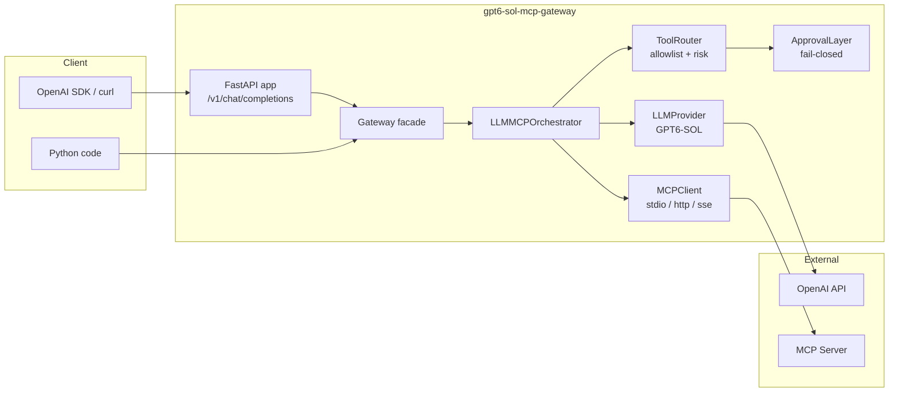

# GPT6-SOL MCP Gateway

> Production-ready MCP gateway for GPT6-SOL. Use as a library or deploy as a FastAPI service.

[](https://github.com/rwamyth-blip/gpt6-sol-mcp-gateway/actions/workflows/ci.yml)
[](https://pypi.org/project/gpt6-sol-mcp-gateway/)
[](https://pypi.org/project/gpt6-sol-mcp-gateway/)
[](https://opensource.org/licenses/MIT)

---

## 🎯 What is this?

`gpt6-sol-mcp-gateway` connects **GPT6-SOL** (and the rest of the GPT-6 / GPT-5.6 family) to any
**Model Context Protocol** server, then exposes the whole thing either as a **Python library** or as
an **OpenAI-compatible HTTP API**.

It solves three problems that show up the moment you put an LLM in front of real tools:

1. **Tool-calling safety** — a three-gate pipeline (allowlist → risk classification → human approval)
   means the model can never silently run a destructive tool.
2. **Provider quirks** — the GPT-6 family rejects `reasoning_effort` together with function tools on
   `/v1/chat/completions`. This gateway handles that automatically.
3. **Secret leakage** — every log line passes through a redactor that strips API keys, bearer tokens,
   JWTs and connection strings before they reach stdout.

---

## ✨ Features

- 🔌 **Three MCP transports** — `stdio`, `http`, and `sse`, behind one `MCPClient` interface.
- 🛡️ **Three-gate tool safety** — allowlist, risk classification (40 destructive verbs), and a
  fail-closed approval layer.
- 🧠 **GPT-6 aware** — knows the model catalogue, aliases, context windows, pricing, and the
  `reasoning_effort` + tools incompatibility.
- 🚀 **OpenAI-compatible API** — drop-in `/v1/chat/completions` with streaming, so any OpenAI SDK
  client works unchanged.
- 🧰 **MCP server included** — expose the gateway itself as an MCP server over stdio.
- 🔒 **Secret redaction** — 11 regex rules applied to every log record.
- 🐳 **Docker ready** — multi-stage image, non-root user, healthcheck, compose file.
- ✅ **Typed and tested** — full type hints, `mypy --strict` clean, 200+ tests, no network required.

---

## 🚀 Quick Start

```bash
pip install "gpt6-sol-mcp-gateway[all]"
export OPENAI_API_KEY="sk-..."
gpt6-mcp-gateway serve --port 8080
```

```bash
curl http://localhost:8080/v1/chat/completions \
  -H "Content-Type: application/json" \
  -d '{"model": "gpt-6-sol", "messages": [{"role": "user", "content": "Hello!"}]}'
```

---

## 📦 Installation

=== "pip (library only)"

    ```bash
    pip install gpt6-sol-mcp-gateway
    ```

    Installs the core orchestration stack: `openai`, `pydantic`, `httpx`, `mcp`.

=== "pip (with HTTP server)"

    ```bash
    pip install "gpt6-sol-mcp-gateway[server]"
    ```

    Adds `fastapi` and `uvicorn` so you can run `gpt6-mcp-gateway serve`.

=== "pip (everything)"

    ```bash
    pip install "gpt6-sol-mcp-gateway[all]"
    ```

=== "Docker"

    ```bash
    docker run --rm -p 8080:8080 \
      -e OPENAI_API_KEY="sk-..." \
      ghcr.io/rwamyth-blip/gpt6-sol-mcp-gateway:latest
    ```

=== "From source"

    ```bash
    git clone https://github.com/rwamyth-blip/gpt6-sol-mcp-gateway.git
    cd gpt6-sol-mcp-gateway
    pip install -e ".[all,dev]"
    ```

---

## 💡 Usage Examples

### Example 1 — Library: ask GPT6-SOL a question

```python
import asyncio
from gpt6_sol_mcp import Gateway

async def main() -> None:
    async with Gateway(connect_mcp=False) as gateway:
        result = await gateway.chat([{"role": "user", "content": "Explain the Model Context Protocol in two sentences."}])
        print(result.content)

asyncio.run(main())
```

### Example 2 — Library: let the model call MCP tools

```python
import asyncio
from gpt6_sol_mcp import Gateway, allow_all_approver

async def main() -> None:
    async with Gateway(approver=allow_all_approver()) as gateway:
        result = await gateway.chat([{"role": "user", "content": "List the files in the current directory."}])
        print(result.content)
        for call in result.invocations:
            print(f"  → {call.tool}({call.arguments}) = {call.result}")

asyncio.run(main())
```

### Example 3 — Server: OpenAI SDK against the gateway

```python
from openai import OpenAI

client = OpenAI(base_url="http://localhost:8080/v1", api_key="not-needed")

stream = client.chat.completions.create(
    model="gpt-6-sol",
    messages=[{"role": "user", "content": "Summarise MCP in one line."}],
    stream=True,
)
for chunk in stream:
    print(chunk.choices[0].delta.content or "", end="")
```

More runnable examples live in [`examples/`](https://github.com/rwamyth-blip/gpt6-sol-mcp-gateway/tree/main/examples).

---

## 🏗️ Architecture



The orchestrator runs a bounded loop:

1. Send the conversation plus the advertised tool schemas to GPT6-SOL.
2. If the model asks for tools, route each call through the allowlist and risk classifier.
3. Ask the approval layer. A denial is fed back to the model as a tool error, not a crash.
4. Execute approved calls against the MCP server and append the results.
5. Repeat until the model answers without requesting tools, or the iteration cap is hit.

---

## 📚 Documentation

Full documentation: **<https://rwamyth-blip.github.io/gpt6-sol-mcp-gateway/>**

| Page | Contents |
| --- | --- |
| [Getting Started](https://rwamyth-blip.github.io/gpt6-sol-mcp-gateway/getting-started/) | Install, configure, first request |
| [Architecture](https://rwamyth-blip.github.io/gpt6-sol-mcp-gateway/architecture/) | Component map and request lifecycle |
| [Library Usage](https://rwamyth-blip.github.io/gpt6-sol-mcp-gateway/library/) | `Gateway`, orchestrator, custom approvers |
| [Server Usage](https://rwamyth-blip.github.io/gpt6-sol-mcp-gateway/server/) | FastAPI routes, streaming, Docker |
| [MCP Server](https://rwamyth-blip.github.io/gpt6-sol-mcp-gateway/mcp-server/) | Expose the gateway as an MCP server |
| [Configuration](https://rwamyth-blip.github.io/gpt6-sol-mcp-gateway/configuration/) | Every environment variable |
| [Security](https://rwamyth-blip.github.io/gpt6-sol-mcp-gateway/security/) | Threat model and hardening |
| [API Reference](https://rwamyth-blip.github.io/gpt6-sol-mcp-gateway/api/) | Generated from docstrings |

---

## 🤝 Contributing

Contributions are welcome. Please read [CONTRIBUTING.md](https://github.com/rwamyth-blip/gpt6-sol-mcp-gateway/blob/main/CONTRIBUTING.md)
and our [Code of Conduct](https://github.com/rwamyth-blip/gpt6-sol-mcp-gateway/blob/main/CODE_OF_CONDUCT.md) first.

```bash
make install   # editable install with dev extras
make check     # lint + format check + type check + tests
```

---

## 📄 License

Released under the [MIT License](https://github.com/rwamyth-blip/gpt6-sol-mcp-gateway/blob/main/LICENSE).

---

## ⭐ Star History

[](https://star-history.com/#rwamyth-blip/gpt6-sol-mcp-gateway&Date)
